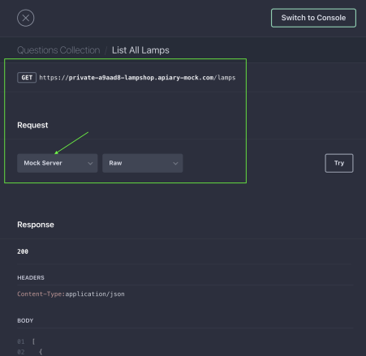

<a id='anchor'>
#Онлайн магазин "EASY".

__ТЗ:__

Сверстать landing page по макету в [Figma](https://www.figma.com/proto/5nbYPIJ1xbTSfYLkWdtIbU/Design?node-id=1%3A2&scaling=scale-down&page-id=0%3A1)
1. Один слайд — одно состояние. Будет плюсом добавить анимацию для переходов
между состояниями. Высота страницы должна занимать 100% области просмотра.
2. [Документация API.](https://lampshop.docs.apiary.io/#reference/0/questions-collection) Чтоб получить рабочий запрос нужно выбрать Mock Server, как на скрине:

3. Необходимо GET запросом получать список товаров и отрисовывать его на
странице.
4. Пока данные загружаются на страницу, плюсом будет добавить иконку загрузки в места, где данные должны будут появиться.
5. Макет должен быть отзывчивым.
6. Создать сетку, используя CSS Flex Layout (флексы) или CSS Grid Layout (гриды).

_Рекомендации к выполнению:_
* Векторные элементы оформлять в формате .svg.
* Предусмотреть webp и ретина.
* Простые геометрические фигуры лучше рисовать с помощью css.

_Требования:_
* Использовать препроцессоры.
* Использовать Gulp или Webpack для сборки.
* Использовать БЭМ методологию при верстке макета.
* Использовать семантический HTML5.
* Верстка должна соответствовать стандартам W3C.
* Верстка проходит тест на переполнение контентом. 

    Верстка не ломается:
        При добавлении в элементы большего количества текста.
        При использовании картинок с неподходящими размерами.
        Текст не должен выпадать из объектов.
        Переполнение контентными блоками не приводит к нарушению сетки.

* Кроссбраузерность.
* Использовать сброс стилей css.

_Способ передачи:_
* Исходный код проекта нужно выложить на github.
* Выложите куда-то рабочее приложение, например, на GitHub Pages.
* Добавьте к решению инструкции по запуску проекта README.md.

[Вверх](#anchor)